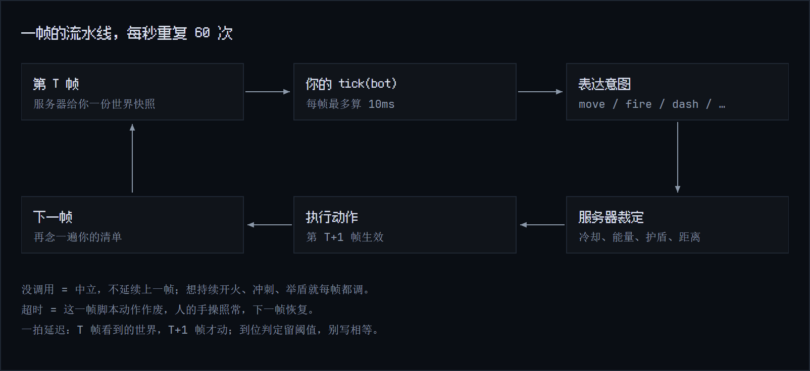
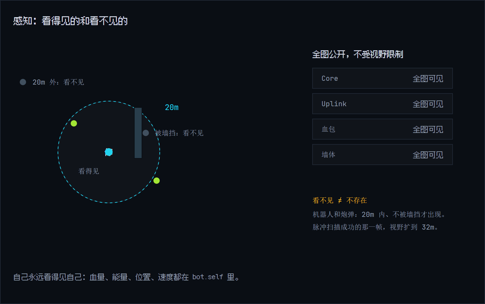
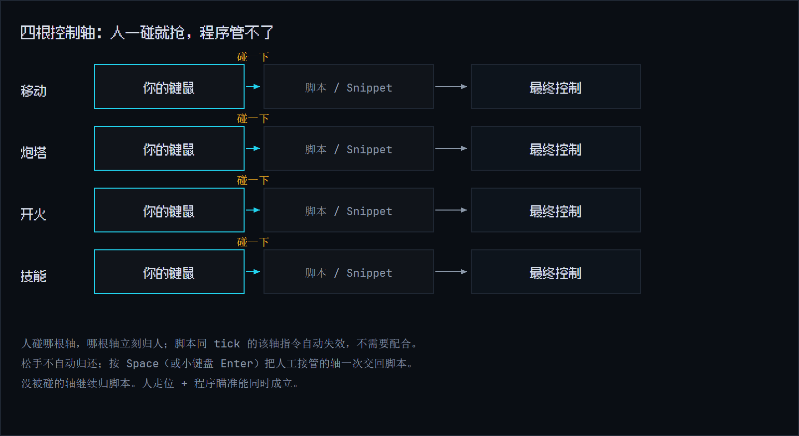

# 写第一个 Bot

Bot Script 是你给机器人写的控制程序，用 JavaScript 或 TypeScript，在网页编辑器里提交，服务器负责运行和热更。

这一页从零讲起：先建立心智模型，再写五行代码跑起来，最后过一遍感知、动作和提交规则。

## 心智模型：程序每秒被念 60 遍

游戏世界每秒推进 60 帧。你的程序不是"跑一次就完"的脚本，而是**一份每秒被念 60 遍的指令清单**：

- 第 1 帧念一遍，机器人照做；
- 第 2 帧再念一遍，再照做一遍；
- 一局 8 分钟，一共念 28,800 遍。

所以你写的不是"先走三秒再开枪"这种流程表，而是"每一帧该怎么办"的决策规则：看到敌人就瞄，附近有 Core 就过去捡。游戏每帧问一次"这一帧干嘛"，你答一次。这个每帧被调用的函数叫 `tick`。



## 五行代码起步

```ts|js
两种写法等价：TS 版直接写类型，JS 版用 JSDoc 注释拿类型提示。游戏只运行 JS，TS 提交前会在浏览器里编译成 JS。
```
```ts
import type { BotContext } from '@omb/bot-api'

function tick(bot: BotContext) {
  const core = bot.nearestCore()
  if (core) bot.navigateTo(core)
}
```
```js
/** @param {import('@omb/bot-api').BotContext} bot */
function tick(bot) {
  const core = bot.nearestCore()
  if (core) bot.navigateTo(core)
}
```

逐行拆开看：

| 代码 | 人话 |
|---|---|
| `import type { BotContext } ...` | 只给编辑器看类型。服务器跑的是编译后的 JS，这行会被剥掉 |
| `function tick(bot: BotContext) {` | 每帧游戏调用这个函数，`bot` 是当帧的控制对象 |
| `bot.nearestCore()` | 问一句"全图最近的 Core 在哪"，没有就返回 `null` |
| `if (core) ...` | 找到了才走 |
| `bot.navigateTo(core)` | 沿服务器算好的路线走过去。碰到 Core 自动拾取 |

## 在网页编辑器里提交

1. **打开编辑器**。对局顶部点 **编辑器**，或按 `C`。文档（`M`）和编辑器可以上下分栏同开。
2. **选语言**。右上角 **JS / TS** 开关，按房间码加昵称记住。两种语言的草稿分开存，互不覆盖。
3. **写代码**。Monaco 编辑器给你语法检查、类型检查和 API 补全。检查只是参考，不代表服务器会接受，更不代表打得好。
4. **提交**。点 **提交到机器人**，或按 `Ctrl+Enter`（macOS 是 `Cmd+Enter`）。TS 模式先在浏览器里编译，编译失败不发任何内容，旧脚本继续跑。
5. **等回执**。成功时显示"服务器已加载 rN"，新脚本从下一帧起执行。失败会给出原因，旧脚本照常跑。断线或超时表示结果未知，别当成失败。
6. **开辅助**。提交成功不会自动开辅助。旁边的 **辅助 ON/OFF** 是独立开关，打开后脚本动作才生效。
7. **看日志**。`console.log` 显示在编辑器下方，带脚本版本和帧号。超长或刷屏的日志会提示截断。

草稿按"房间码 + 昵称 + 语言"存在浏览器本地，刷新不丢。刷新页面和开新局都不会自动提交。

## `bot` 是每帧递给你的东西

```js
bot.self   // 你自己：id、血量、能量、位置、速度（当帧快照）
bot.game   // 对局：已进行时间、剩余时间、当前阶段、地图种子
bot.scan() // 感知快照，免费，每帧随便读
bot.move() // 动作和便利方法都挂在同一个 bot 上
```

三条规则要背下来：

- **模块级变量就是你的记忆。** 写在 `tick` 外面的变量跨帧存活，"上一个目标是谁""巡逻到第几个点"都靠它记。热更成功程序重建，记忆从零开始。
- **每帧最多算 10 毫秒。** 超时这一帧的动作全部作废，人的手操不受影响，下一帧恢复。这是防死循环的保护，正常写碰不到。每帧都超时，就等于每帧都没有动作。
- **一拍延迟。** 你在第 T 帧看到的世界是 T 时刻的，指令到 T+1 帧才生效。所有"到位"判断都要留余量：写"距离小于 2m 就算到了"，别写"距离等于 0"。

`bot` 参数每帧都是新建的，别把自己的状态挂上去；要记东西就放模块级变量。

## 感知：`scan()` 不要钱

服务器每帧替你算好一张快照：半径 20m 内、不被墙挡的机器人和炮弹，加上全图公开的 Core、Uplink 和血包。



```js
const obs = bot.scan()
obs.robots       // 看得见的机器人：{ id, position, hp }
obs.cores        // 全图 Core：{ id, x, y }
obs.uplinks      // 全图 Uplink：{ id, x, y, ready, holder? }
obs.projectiles  // 看得见的炮弹：{ id, x, y }
obs.tick         // 快照对应的帧号
```

- `scan()` 零能量、零动作成本，每帧读多少次都行。
- 看不见的敌人不在这张表里。被墙挡住或超过 20m 的机器人就是不可见，**看不见不等于不存在**。
- 你自己不在 `robots` 里，用 `bot.self`；已阵亡的会被过滤。
- `bot.pulseScan()` 花 12 能量、冷却 2 秒，成功执行的那一帧视野扩到 32m。它返回的仍是调用前的快照，别拿返回值判断成功。

逐字段说明在[数据结构参考](../reference/data.md)。

## 动作速查

原语七个，自己组合策略：

| 方法 | 一句话 |
|---|---|
| `move(vx, vy)` | 表达移动方向和力度，满速 8 m/s |
| `aimAt(angle)` | 炮塔转向，单位弧度 |
| `fire()` | 开火，250ms 一发，耗能 5 |
| `dash()` | 按住式冲刺：16 m/s，耗能 20/秒 |
| `shield(on)` | 开关护盾：减伤 65%，不能开火，耗能 18/秒 |
| `interact()` | 按住引导，黑入 Uplink |
| `say(text)` | 全场喊话，3 秒冷却 |

便利层七个，省掉重复代码：

| 方法 | 一句话 |
|---|---|
| `moveTo(pos)` | 直线走向目标点，不绕障碍 |
| `navigateTo(pos)` | 服务器确定性 A*，绕墙、边界和未开放区域 |
| `aimAt(target)` | 直接瞄一个看得见的机器人 |
| `nearestEnemy()` | 视野内最近的敌人，没有返回 `null` |
| `nearestCore()` | 全图最近的存活 Core |
| `nearestUplink()` | 全图最近的激活 Uplink |
| `pulseScan()` | 花能量的增强感知 |

每个动作的参数、判定和坑，见[动作参考](../reference/actions.md)与[便利层参考](../reference/helpers.md)。

## 能量是唯一的钱

能量上限 100，每秒回 10。所有动作都花它：

| 动作 | 消耗 |
|---|---|
| 开火 | 5 / 发 |
| 冲刺 | 20 / 秒 |
| 护盾 | 18 / 秒 |
| 脉冲扫描 | 12 / 次 |

不算回复，100 能量能打 20 发、冲刺 5 秒或者举盾 5.6 秒。算上每秒回 10，一路猛冲净耗约 10/秒，一直举盾净耗约 8/秒。护盾和冲刺同 tick 只能选一个，护盾优先。脚本要按需调用，别无条件拉满。

## 和手操共存

脚本跑着，玩家照样能随时插手。控制权拆成四根轴：



人被抢走的轴，你的指令自动失效，你不需要配合。别想着"检测玩家在开车然后让位"，脚本**看不到**手操状态，游戏也没打算让你看。每帧照常发全部指令就行。

## 提交契约：JS 直提，TS 先编译

服务器只接受能直接加载的 JS，永远收不到 TypeScript。

- **JS 模式**：源码原样提交。想有类型提示，用上面那行 JSDoc 注释。
- **TS 模式**：类型注解、`type`、`interface`、`enum` 都能写，提交时浏览器内编译成 JS 再发。编译错误按 TS 源码的原始行列提示，不会发出任何内容。

两种模式都守这些约束：

- **入口二选一**：顶层 `function tick(bot) {}`，或者 `const bot = { tick(bot) {} }` 对象，后面可以另起一行 `export default bot`。
- **有限的 import / export**：服务器会剥掉单行 `import type ...`、无绑定的 `import '模块名'`、单行 `export default ...`，以及声明前的 `export`。它不加载依赖，也不做完整模块解析。别用普通绑定导入，也别写 `export default { tick(bot) {} }`，那一整行会被删掉。
- **JS 模式不接受 TS 语法**：类型注解、`type` / `interface` / `enum`、`as const`、`Array<number>` 都会整份拒收。要写 TS 就切到 TS 模式。
- **消息大小上限 64 KiB（65536 字节）**。这是编码后的整条消息，包含 UTF-8 源码和协议开销，不只是字符数。TS 模式下编译后的 JS 和 TS 原文同帧发送、都计入。超限会在本地拦下并显示实际字节数。

拒收或加载失败时，旧脚本继续跑。

## 热更

局中随时能提交新版本，成功加载后从后续帧生效。

- 加载失败，比如语法错、缺入口，旧版本继续跑。
- 加载成功但某帧运行超时，只清空那一帧的动作，不回滚旧版本。
- 热更成功后程序重建，模块级记忆清零。这是有意设计，别依赖跨版本状态。

## 调试

- `console.log` / `info` / `warn` / `error` / `debug` 都显示在编辑器下方的 Console 面板，带脚本版本和帧号。
- 面板可以折叠、清空；新日志只在你原本贴着底部时自动跟随滚动。
- 常见故障：动作没反应，先查是不是没调、是不是能量不够、是不是护盾挡了开火；脚本不生效，先看回执是失败还是超时；`aimAt` 传了不可见的机器人会当场抛异常，那一帧的动作全部作废。

## 递进路线

1. **五行捡 Core**：上面第一个例子。
2. **加上开火**：

```ts
function tick(bot) {
  const enemy = bot.nearestEnemy()
  if (enemy) {
    bot.aimAt(enemy)
    bot.fire()
  }
}
```

3. **看阶段**：`bot.game.phase === 'CORE_OPEN'` 之后再往中央走。
4. **写状态机**：巡逻点循环、残血撤退、抢桩计时。
5. **算弹道**：游戏不给提前量，但感知里有目标 `velocity`，自己外推落点。乐趣也在这里。

`docs/manual/examples/` 下有六个完整示例，每个不超过 60 行，带注释讲解：

| 示例 | 教什么 |
|---|---|
| `hello-bot.ts` | 最小闭环：感知 → 索敌 → 转向 → 开火 |
| `patrol.ts` | 模块级状态 + 路标巡逻 |
| `core-farmer.ts` | 捡 Core 得分，路过交火 |
| `uplink-rusher.ts` | 站桩引导与等待估算 |
| `shield-brawler.ts` | 近战护盾、位移与能量管理 |
| `flank-strike.ts` | 侧翼走位与报点 |

游戏内阅读器只显示 Markdown，示例源码请到仓库里看；关键片段也内嵌在[模块语义与陷阱](../reference/modules.md)的各节里。

用中文改码的玩法见 [AI Agent](../start/ai-agent.md)。
