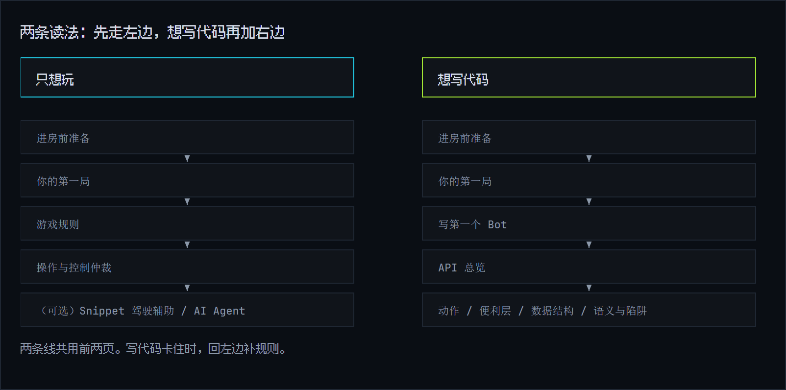

# oh-my-bot 玩家手册

最多 64 台机器人同场乱斗，一局 8 分钟。键盘鼠标就能玩。不想手操，可以挂上官方 Snippet；想让它自己打，可以写 JS/TS 脚本，也可以让 AI 替你改代码。

这页是手册地图。新手照"上手四步"走；写代码的人看完前两步，直接进[写第一个 Bot](code/bot-scripting.md)。

图上两条线共用前两页。左边那条只玩不写代码，右边那条一路走到 API。

## 上手四步

1. **进房**。打开部署地址，自己起一个 4–8 位的房间码，填昵称、挑颜色。第一个进房的人自动当房主。
2. **开局**。房主点"热身场"练手，或直接点"开始对局"。热身场照样受伤、照样死，只是不记分。
3. **抢分**。前 4 分钟在外环捡 Core、抢 Uplink。4:00 一到，中央核心区开门。
4. **看结算**。8 分钟打完，看分数和称号。房间不散，房主随时能开下一局。

每一步的细节在[进房前准备](start/prepare.md)、[你的第一局](start/first-match.md)和[游戏规则](rules/game-rules.md)。

## 四种玩法，一层比一层深

| 玩法 | 怎么做 | 适合谁 |
|---|---|---|
|  手操 | WASD 走位，鼠标瞄准，左键开火 | 所有人。第一局先这么玩 |
| Snippet 驾驶辅助 | 在"辅助"面板勾官方模块、调参数，一键开启 | 不想写代码，又想让机器人自动干活 |
| AI Agent | 用中文说想改什么，服务器替你改源码 | 目标明确，不想碰语法 |
| 自己写 Bot Script | 网页编辑器写 JS/TS，提交后在局内热更 | 想精确控制每一个动作 |

四种玩法能混着用。你一碰键鼠，碰到的轴立刻归你；Snippet 和你自己的代码跑在同一套仲裁里，互不打架。

## 手册地图

| 章节 | 讲什么 | 什么时候看 |
|---|---|---|
| [快速上手](start/index.md) | 进房、第一局、Snippet、AI | 第一次进游戏 |
| [游戏规则](rules/index.md) | 地图、得分、复活、按键与控制仲裁 | 想弄清游戏怎么判定 |
| [写自己的 Bot](code/index.md) | 编辑器、tick 模型、提交与热更 | 准备写代码 |
| [API 参考](reference/index.md) | 13 个动作、数据结构、语义与陷阱 | 写代码时随手查 |

## 十个词看懂全场

| 词 | 一句话 |
|---|---|
| Robot / Player | Robot 是场上的机器人，Player 是操作它的人 |
| Bot Script | 你写或 AI 改的控制程序，JS/TS，跑在服务器上 |
| Snippet | 官方预置的 Bot Script 模块，源码可查，勾选即用 |
| Observation | 你的感知快照：视野里的机器人和炮弹，加上全图公开的 Core 和 Uplink |
| `scan()` | 读取感知快照，免费，每帧都能读 |
| Core | 碰一下就捡的得分资源，顺带回能量。Mega Core 更值钱 |
| Uplink | 站桩引导 8 秒的得分设备，玩家习惯叫"桩" |
| Phase | 一局只有两段：外环争夺（0:00–4:00）与核心开放（4:00–8:00） |
| 驾驶辅助 | 允许 Snippet 或脚本替你动作的总开关，默认关闭 |
| 热更 | 局中提交新代码，下一帧起生效；加载失败就继续跑旧版 |

## 三条铁律

1. **转段只开门**。4:00 只解锁中央区域，伤害、能量、冷却这些数值从头到尾不变。
2. **感知免费**。`scan()` 随便调，不耗能量；反过来，看不见就打不到。
3. **人永远优先**。你一碰键鼠，碰到的轴立刻归你；松手不会自动交还，按 `Space` 交还。
