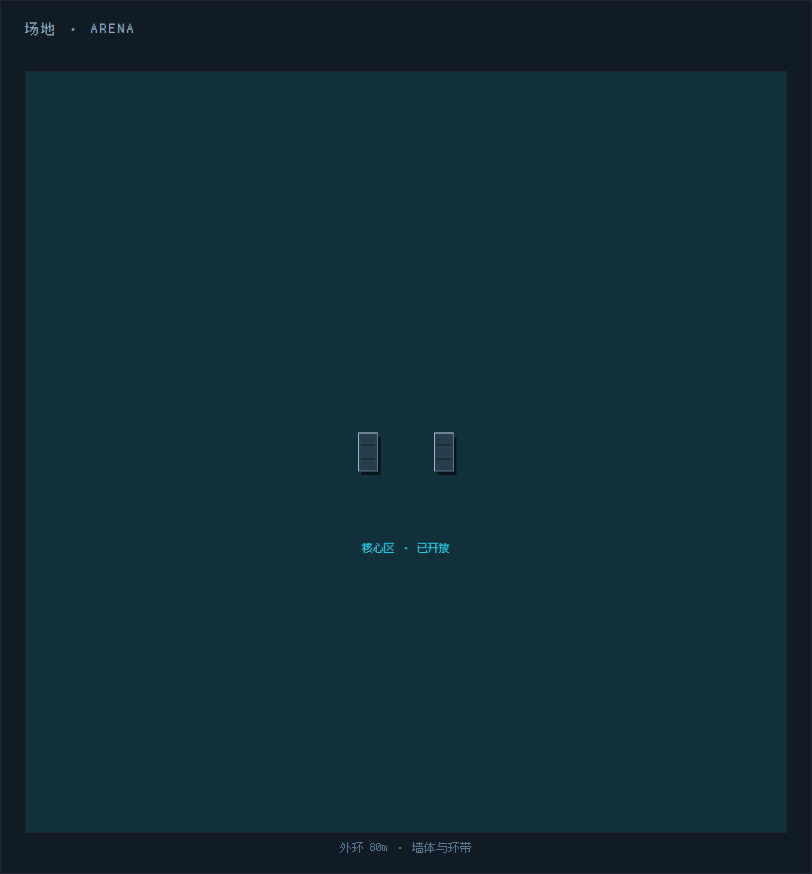
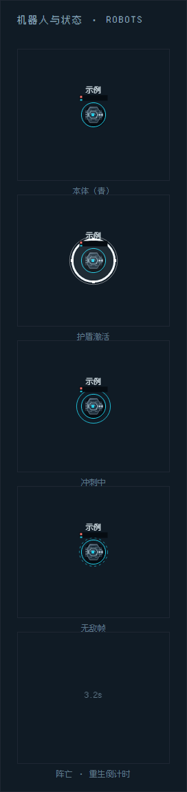
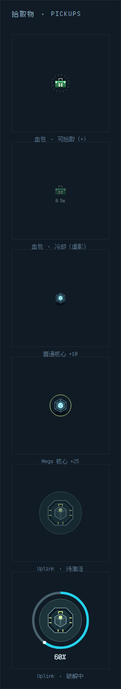
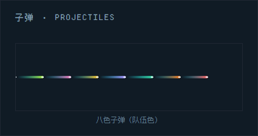
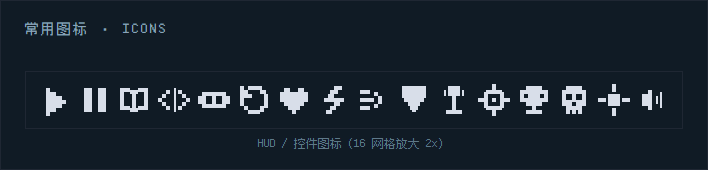
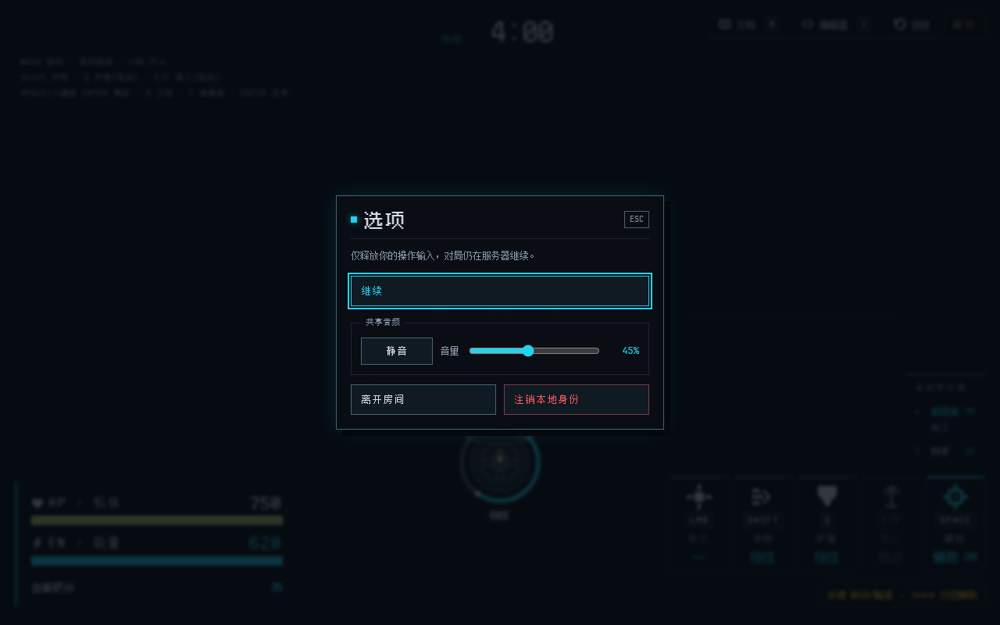
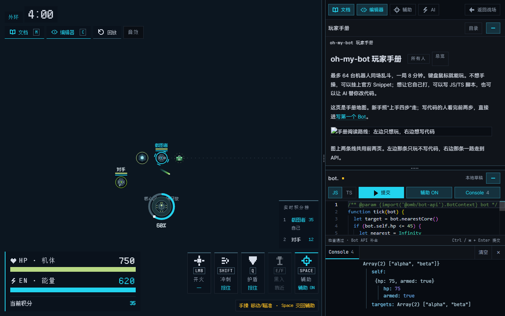
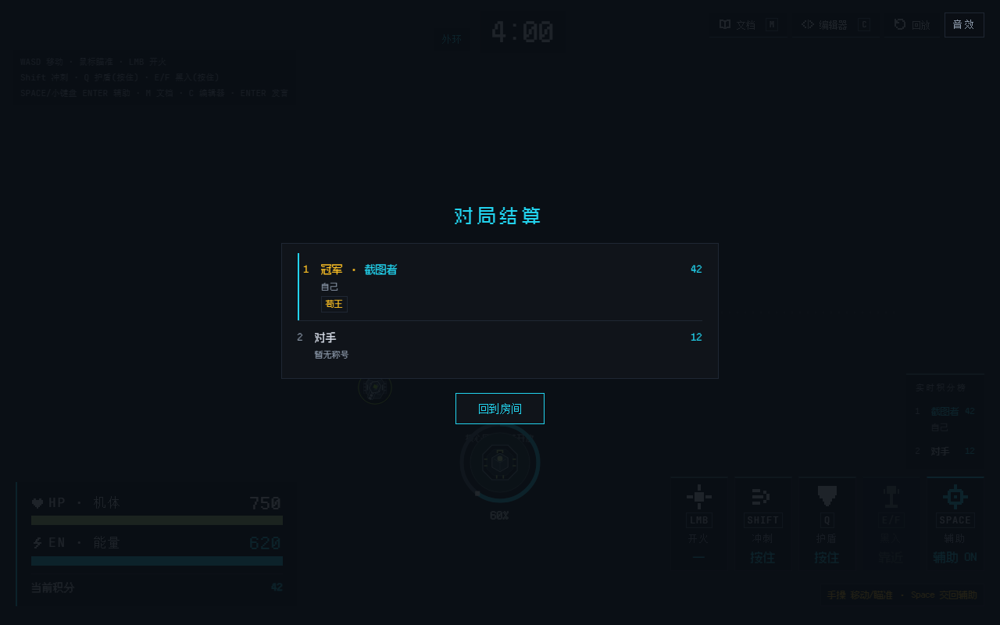

# 图鉴：界面与实体

这一页是"实物照片"：实体图直接用游戏渲染器生成，界面图从真实的客户端页面截取，不是手绘示意图。

想重新生成，在仓库根目录跑 `pnpm --dir client capture:manual`，输出固定写进 `docs/manual/reference/images/`。

## 场地

外环 80m、核心区、掩体和出生区都来自实际渲染器。核心区在 4:00 开放后变成青色。

- 外环是硬边界，机器人出不去。
- 核心区在开放前后用不同视觉状态，Mega Core 只在核心区里刷。
- 墙体同时挡移动、挡子弹、挡视线。

## 机器人状态

本体、炮塔、护盾、持续冲刺和复活保护，都用和实战一样的绘制代码。

- 绿条是 HP，青条是能量。
- 青色虚环是复活保护，期间不掉血。
- 护盾和冲刺互斥；按住 `Shift` / 右键，或让脚本每帧 `bot.dash()`，才能持续冲刺。

## 拾取物

血包回满 **30 HP**，冷却 **30 秒**。满血或阵亡的机器人不消耗血包。Core 和 Uplink 也用正式渲染。

- 血包的虚影和秒数表示还在冷却。机器人圆和血包圆接触就能捡，不用中心对齐。
- Uplink 引导时显示进度环，被打断就从头开始。
- Uplink 的个人冷却不下发到脚本感知，要自己拿 `bot.game.time` 估算。

## 子弹与玩家色

每个玩家有自己的颜色，子弹拖尾跟着发射者颜色走，看一眼就知道火力从哪来。

## 常用图标

HUD、技能卡组和音频控件共用的像素图标，按 2 倍尺寸展示。

## 大厅

加入页有房间码、昵称、配色和观战入口。音频设置在所有页面之间共享。

## 对局 HUD

HUD 同时显示 HP、能量、阶段、技能和每根轴的控制来源。场上能看到真实的血包、Core、Uplink 和玩家色子弹。

## Esc 选项

对局中按 `Esc` 打开本地选项层。打开时只释放你自己的按住输入，服务器对局不会暂停。可以继续游戏、调音量、离开房间或注销本地身份。

## 工作台

按 `C` 打开脚本工作台。编辑器、Console 和玩家手册共用侧栏，本地草稿离开房间后仍保留。

## 结算

结算层显示最终得分和称号。离开结算就回到房间状态。

