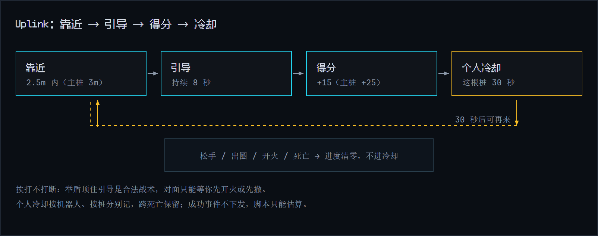

# 游戏规则

一局 8 分钟，最多 64 人，人人互为对手。基础规则从头到尾不变，4:00 的转段只做一件事：打开中央区域。

## 一局的结构

```
Room（房间）
 ├─ Warmup（热身场）：规则与时长跟正式局一样，只是不记积分
 └─ Match（对局）× N = Session（场次）：局散房不散，积分累计
     ├─ 0:00–4:00  OUTER_RING  外环争夺
     └─ 4:00–8:00  CORE_OPEN   核心开放
```


## 地图：三环八扇区

地图是一个大圆，从外到内分三环，像一张靶纸。


| 环 | 半径 | 有什么 |
|---|---|---|
| 外环 Outer | 55–80m | 8 个出生扇区，你随机分到其中一个 |
| 中环 Mid | 30–55m | 6 根 Uplink，位置故意错开扇区轴线，防止出门就占桩 |
| 中央核心区 | 半径 28m | 4:00 前整片锁死，主 Uplink 随转段激活 |

几条地形规则：

- 人不满 64 时平均分进 8 个扇区。24 人就是每扇区 3 人。
- 参考尺寸 160×160m。墙体、掩体和资源点的布局每局随机生成，三环骨架和扇区结构永不变化。
- 障碍只有实体墙，挡机器人、挡炮弹、挡视线，同一套判定。4:00 前的中央核心区同样挡人、挡视线。
- 机器人相撞会互相推开，带一下短促击退，但不掉血，也不取消冲刺。没有移动输入时击退很快衰减，不会一直滑。
- 视野半径 20m，不穿墙；弹丸最远也飞 20m。**看得见的才打得到**，反过来说，你被打到的那一刻，对方也在你视野里。

## 得分表

| 行为 | 得分 |
|---|---|
| 捡 Core | +10；Mega Core +25，全图只有 2 颗，都在中央核心区 |
| 黑入 Uplink | +15，中央主桩 +25 |
| 击毁 | +25 |
| 助攻 | +10 |
| 每次命中 | +1 |

Core 开局先刷 1 颗，之后每 20 秒补 1 颗；4:00 一过，中央的刷新权重明显变高。资源分明显高于人头分。这是个抢资源、抢据点的游戏，不是纯死斗。死亡不掉分，惩罚就是离场 3 秒，让对手趁机得分。

排行榜按总分降序，同分按机器人 ID 排。按 Uplink 得分、击毁数、存活时间逐级判胜的规则还没接。

## Uplink：可反复争夺的桩

Uplink 散布在中环和中央，玩家习惯叫"桩"。



1. **靠近**：走到桩周围 2.5m 内，主桩 3m。
2. **引导**：按住 `E` 或 `F`，脚本则每帧调 `interact()`。顶满 8 秒。
3. **得分**：+15，主桩 +25。
4. **冷却**：你对这根桩进入 30 秒个人冷却。别人不受影响，随时能来抢。冷却跨死亡保留。

引导期间会发生什么：

| 事件 | 引导断不断 |
|---|---|
| 被子弹打 | 不断。举盾硬顶是合法战术 |
| 松开按键 | 断 |
| 移出范围 | 断 |
| 开火 | 断，自己开枪打断自己 |
| 死亡 | 断 |

中断后前 0.5 秒进度保持；仍未续上时，此后每 1 秒回退 0.5 秒进度，直到归零，但不进冷却。只有黑成功才触发 30 秒冷却。攻防的博弈点就在这里：防守方站在旁边开枪赶人，伤害本身打不断引导，只能逼你开火或撤离，并争取让积累进度逐步回退。

中央主桩 4:00 随转段激活，值 25 分。在那之前，中环 6 根桩是外环的主要争端。

## 全员敌对

- 纯 FFA，所有机器人互为敌人，子弹能打任何人。
- 没有搭档、队友、友伤豁免、共享视野、协作分，也没有"最佳搭档"称号。
- 旧录像里的 Partner 字段和 BEST_PARTNER 枚举只是为了读旧数据，新对局不会再产生。

## 死亡、复活与无敌

死亡后 3 秒，在你所属扇区的出生点复活，满血满能量，防止滚雪球。

复活自带无敌，规矩分三档：

- **原地不动**：一直保留无敌。
- **开始操作**：瞄准、移动、切辅助等有效操作后 4 秒解除，后续操作不再刷新计时。
- **开火或引导**：立刻解除。

实用结论：无敌够你跑出出生点的火力范围，但不保护输出。想拖时间就停手别动；跑起来之后 4 秒内是安全窗口。

## 血包

- 中环有 4 个固定血包点，位置公开，不会长在墙里或锁区里。
- 受伤且存活时碰到血包回 30 HP，上限 100。满血不消耗，死人拿不走。
- 同一帧多人重叠，按机器人 ID 顺序只判一个人拾取。
- 拾取后这个点冷却 30 秒。血包不加分。

## 击毁、助攻与命中

- 血量 100，每发子弹 12 点，大约 9 发击毁一个人。命中一次 +1 分。
- 击毁归**最后一击**，+25，不改判给伤害最高的人。
- 每个人命里累计各个攻击者造成的实际扣血：先算护盾减伤，再按剩余血量截断。过量伤害、无敌期的 0 伤害、自伤都不计入。
- 帮过忙但不是最后一击，且伤害占比严格低于 50%，每人 +10 助攻。可以多人同时拿，按机器人 ID 排序。刚好 50% 不算。
- 最后一击者伤害占比严格低于 50%，记一次"抢人头"，不额外加分。刚好 50% 不算。

冲刺没有无敌帧；护盾减伤 65%，代价是期间不能开火。防守还是进攻，自己挑时机。

## 称号表

称号从对局事件日志结算，单局结束公布，共 14 项：

| 称号 | 怎么拿 |
|---|---|
| 战争机器 | 击毁最多 |
| 垃圾佬 | 捡 Core 最多 |
| 信号大盗 | 黑入 Uplink 最多 |
| 跑路大师 | 移动距离最长 |
| 铁头娃 | 撞墙最多 |
| 苟王 | 连续存活时间最长 |
| 和平使者 | 高积分且零击毁 |
| 人工智障 | 脚本异常或超时最多 |
| 弹幕大师 | 命中次数最多 |
| AI 常客 | AI 改码轮次最多 |
| 古法编程 | 零 AI、零 Snippet 完赛 |
| 充能面包 | 被击毁最多 |
| 抢人头 | 抢人头次数最多，正数才授予 |
| 耐活王 | 累计实际回血最多，正数才授予 |

「人工智障」按脚本错误次数结算，但当前版本还没有产生这类事件，暂时没人拿得到。结算页目前只显示分数和称号，不显示 AI token 用量；半场累计积分存在服务器上，大厅还没有累计榜界面。
