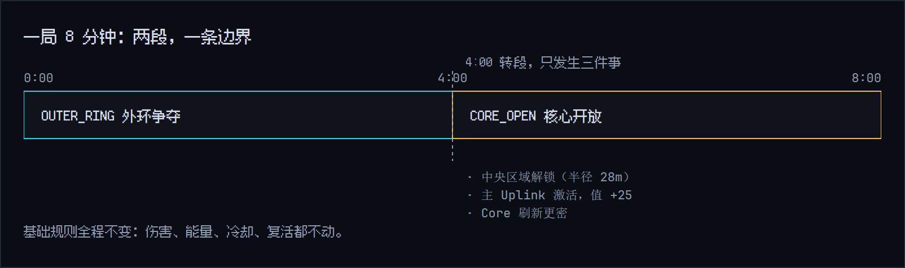
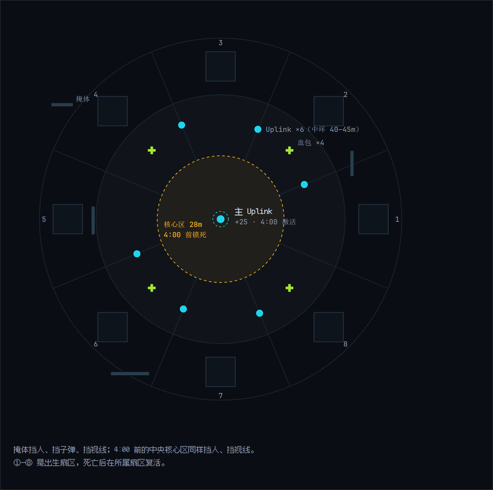

# 你的第一局

这一页只讲上场之后干什么：怎么走、怎么打、怎么得分。不写代码，也不背规则。

## 这局要干什么

8 分钟打完，分高者赢。得分手段按性价比排下来是这样：

| 做什么 | 得分 | 说明 |
|---|---|---|
| 捡 Core | +10 | 走过去自动捡，最稳的分 |
| 黑入 Uplink | +15 | 站桩 8 秒，收益高、风险也高 |
| 击毁敌人 | +25 | 一次一大笔，风险最大 |
| 打中一枪 | +1 | 零钱，顺手就赚 |
| 助攻 | +10 | 你打过他，但最后一击不是你 |

一句话，**捡资源比追杀值钱**。死亡不掉分，代价是离场 3 秒，对手趁机把分赚走。

## 开局先抢 Core

Core 是发光的资源点，机器人边缘一碰到就自动捡，+10，顺带回点能量；冲刺或击退扫过的路径也算。中央区的 Core 更密，但 4:00 前锁着，先在外环捡。

外环 55–80m 是出生带，中环 30–55m 散布 6 根 Uplink，半径 28m 以内是核心区。

## 别追着人打

弹丸最远飞 20m，地图半径却有 80m。追人追不上，还会被放风筝。看到人先掂量：打得过就上，打不过就跑；跑不掉就按住 `Q` 举盾撤退。

你的视野也是 20m，而且被墙挡。Core、Uplink、血包的位置全图公开，敌人和炮弹只有进了视野才看得见。所以别在空地发呆，多贴墙走，转角减速。这是设计，不是 bug。

## 顺手抢一根桩

走到 Uplink 桩 2.5m 内，按住 `E` 或 `F` 不放，顶满 8 秒，+15 到手。

- **挨打不打断**。举着盾硬顶是合法战术，对面打不断你，只能等你先开火或先撤。
- **一开火就断**。引导中途自己开枪，进度清零，从头再来。
- 黑成功之后，你对这根桩有 30 秒个人冷却，别人不受影响，随时能来抢。

4:00 之后中央主桩激活，值 +25，那时候再往中间挤。

## 死了怎么办

3 秒后在你自己扇区的出生点满血复活，还带几秒无敌。无敌的规矩看操作：

- 原地不动：一直无敌。
- 一动（移动、瞄准、切辅助）：4 秒后解除，之后的操作不会重新计时。
- 开火或开始引导：立刻解除。

所以无敌期用来跑路，别用来输出。

## 打完看什么

结算页列分数和称号，一共 14 项。被击毁最多的那位拿到"充能面包"，全场都看得见。

想省力气，下一步试试 [Snippet 驾驶辅助](snippet.md)；想让机器人自己打，去[写第一个 Bot](../code/bot-scripting.md)。
