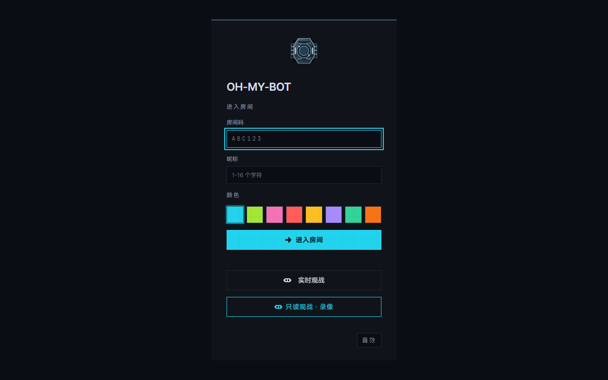
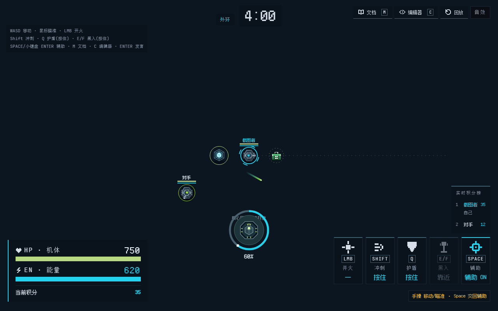

# 进房前准备

这一页带你从打开网址走到坐上机器人：怎么进房、填什么资料、屏幕上每个角落在显示什么、热身场能干什么。看完就能上场。

## 进房

游戏不用注册，不用装客户端，桌面浏览器打开部署地址就能玩。

房主先想一串房间码：**4–8 位大写字母或数字**，填进入口页，进房就是房主。招呼朋友时，把房间码发过去，或者发一条带房间码的链接：

```
https://你的部署地址/?room=AB12CD
```



一个房间最多 64 人，房主一个人也能试跑。游戏不会自动倒计时开局，房主点"热身场"或"开始对局"才开。

## 填昵称和配色

| 项目 | 说明 |
|---|---|
| 昵称 | 1–16 个字符，当前标签页刷新后保留。房间里出现重名，新连接会顶掉旧连接，各起各的 |
| 配色 | 在入口页色板里挑一个，场上靠颜色认人 |

点"进入房间"即可。短暂掉线会自动重连，回到同一个房间、同一个昵称。重连细节见[操作与控制仲裁](../rules/controls.md)。

## 上屏以后，东西在哪



| 位置 | 显示什么 |
|---|---|
| 中央战场 | 视野里的机器人、炮弹和地图资源。普通视野半径 20m，实体墙会挡视线 |
| 顶部中央 | 对局时间和当前阶段 |
| 左上角 | 键位提示，忘了按键看这里 |
| 左下角 | 放大的 HP / EN 条和当前积分 |
| 右下角 | 技能卡（开火、冲刺、护盾、黑入、辅助）与实时积分榜 |
| 顶部操作区 | **文档 M**、**编辑器 C**、回放、音效 |
| 右侧工作台 | 文档和编辑器可以上下分栏；**辅助**、**AI** 面板整列展开 |

## 键鼠速查

| 按键 | 作用 |
|---|---|
| `W` `A` `S` `D` | 移动。全向底盘，八个方向随便走 |
| 鼠标移动 | 瞄准炮塔 |
| 鼠标左键 | 开火，间隔 250ms |
| `Shift` / 右键 | 按住冲刺 |
| `Q` | 按住举盾，减伤 65% |
| `E` / `F` | 按住黑入 Uplink |
| `Space` / 小键盘 `Enter` | 驾驶辅助总开关 |
| `M` / `C` | 开关文档 / 编辑器 |
| `Enter` | 公开发言 |

完整规则和边界情况在[操作与控制仲裁](../rules/controls.md)。

## 焦点决定键鼠归谁

战场画布拿到焦点，WASD、鼠标和快捷键才生效。点击战场，或按 `Tab` 把焦点移过去，就能手操，工作台开着也一样。焦点跑进文档、编辑器、辅助参数或聊天框，键鼠改去打字，机器人交给脚本，游戏画面和服务器模拟继续跑。关掉全部面板，焦点自动回到战场。

窄屏（宽度不超过 760px）时，侧栏盖住战场，右上角的"返回战场"仍然可用。

## 热身场能干什么

房主点"热身场"进练习图，随时能从右上角开始正式对局。两者差别就下面这些：

| | 热身场 | 正式对局 |
|---|---|---|
| 时长 | 8 分钟 | 8 分钟 |
| 受伤、死亡、复活 | 有 | 有 |
| 前 4 分钟中央区 | 锁定 | 锁定 |
| 记分 | 不记，不写房间积分 | 记分，进结算 |
| 对局日志与称号 | 无 | 有 |
| 地图 | 随机生成 | 换局重新生成 |

热身场不会自动开新局：模拟跑满 8 分钟就停住，人留在图里，等房主点“开始对局”换新图。

热身里能练 WASD、瞄准、开火、举盾和黑入；也能打开 **辅助** 面板配 Snippet，或按 `C` 写 JavaScript / TypeScript。代码和 Snippet 都要等服务器回一句"已加载"，再开辅助总开关看效果。检查通过不等于打得对，实战验证不能省。

## 自动补满至 64 台

房主可以在大厅点 **自动补满至 64 台**，让下一场按当前真人席位加入最多 63 个自动 Bot：

- 它们是服务器里的普通脚本机器人，不调用外部 AI，也不开透视。视野一样 20m，一样被墙挡。
- 会移动、捡 Core、打看得见的敌人、抢 Uplink。
- 不占真人席位，不加在线人数，不进房间积分。真人太多、名额不够时，就少加几个。

## 草稿存在哪

代码草稿和 Snippet 配置都按"房间码 + 昵称"存在当前浏览器里，刷新不丢，换设备不跟。面板开关和当前页面路径记在网址里，刷新沿用。刷新页面或开新局都不会自动提交代码，要手动点一次提交。

## 接下来

- 想直接开打：[你的第一局](first-match.md)
- 想看规则：[游戏规则](../rules/game-rules.md)
- 想让机器人自己动：[Snippet 驾驶辅助](snippet.md)，或者读[写第一个 Bot](../code/bot-scripting.md)

顺手看一段代码。下面这 4 行就是一个能自己捡 Core 的机器人，能看懂多少算多少：

```ts
function tick(bot) {
  const core = bot.nearestCore()
  if (core) bot.navigateTo(core)
}
```

它的意思：每一帧问一次"最近的 Core 在哪"，找到了就走过去。想读懂它，去[写第一个 Bot](../code/bot-scripting.md)。
